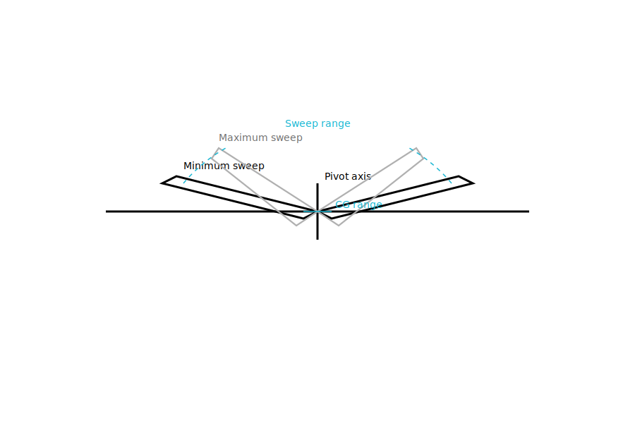
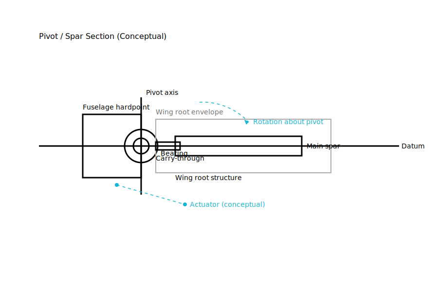
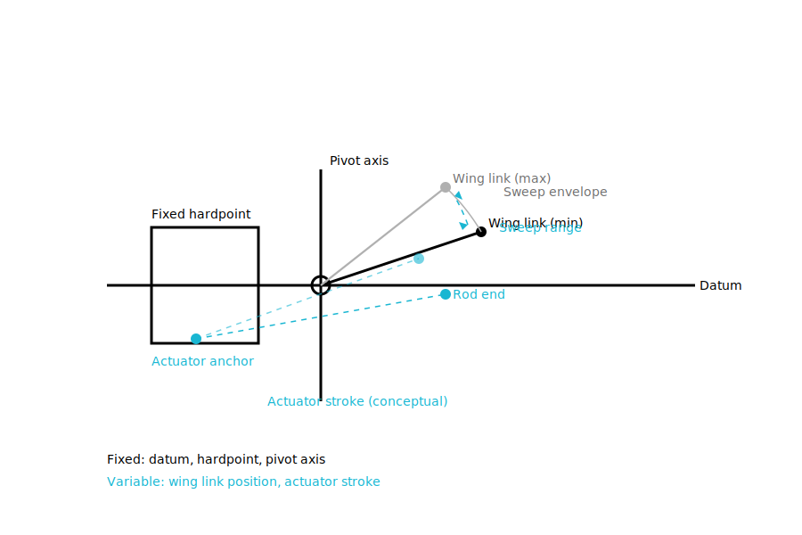
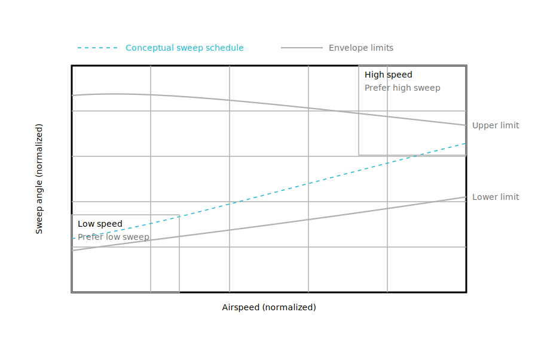

# Variable Wing Sailplane

A conceptual sailplane exploring **variable wing sweep** as a means to trade
low-speed efficiency against higher-speed performance while remaining
mechanically legible.

This project prioritizes **geometry, constraints, and mechanism clarity**
over optimization.

---

## Concept

The aircraft uses a rigid wing with a **single sweep degree of freedom**
about a defined pivot axis.

- Minimum sweep favors low-speed lift and thermalling
- Maximum sweep favors higher-speed cruise and penetration

The core challenge is not sweep itself, but **integrating it cleanly**:
structurally, mechanically, and conceptually.

---

## Planform (what moves, what doesn’t)

- Fixed fuselage and pivot axis
- Identical wing geometry across sweep range
- Explicit sweep envelope and CG awareness

This is the reference diagram for the entire project.

---

## Section (how it carries load)

- Fixed fuselage hardpoint
- Bearing-supported pivot
- Continuous spar through the sweep mechanism
- Structural envelope shown without material assumptions

This diagram explains feasibility without over-specification.

---

## Kinematics (how it moves)

- Single rotational degree of freedom at the wing root
- Actuator stroke shown conceptually
- Constraints made explicit

If motion cannot be explained here, it is not acceptable.

---

## Sweep Envelope (when it moves)

- Normalized airspeed vs sweep
- Upper and lower operational limits
- Conceptual sweep schedule

No units. No claims. Just intent.

---

## Status

- Conceptual geometry: **defined**
- Mechanism architecture: **defined**
- Analysis: **first-order, ongoing**
- Simulation: **not yet authoritative**
- Optimization: **explicitly out of scope**

---

## Structure

- `/specs` — governing assumptions, requirements, standards
- `/diagrams` — canonical figures only (SVG masters)
- `/analysis` — trade studies and reasoning
- `/simulation` — models and scripts (when needed)

Specs define. Diagrams explain. Analysis justifies.

---

## Scope discipline

This repository intentionally avoids:
- marketing renders
- premature performance numbers
- detailed material or certification claims

Those come later, or not at all.

---

## Next steps

Planned work includes:
- first-order aerodynamic estimates
- CG travel vs sweep coupling
- structural load paths at extreme sweep
- actuator sizing after constraints are locked

Only work that preserves conceptual clarity will be added.
